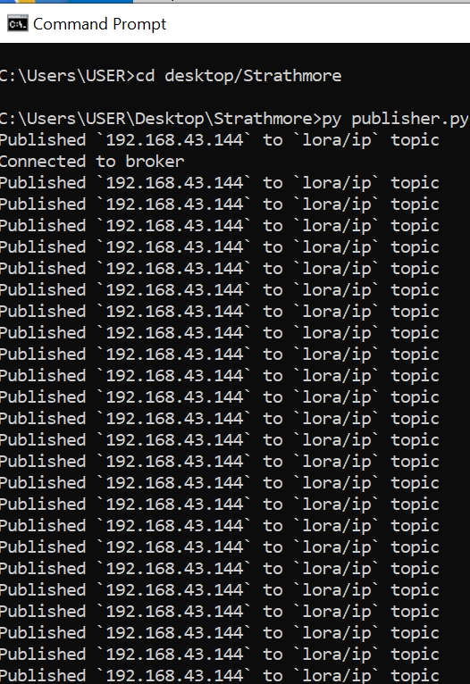
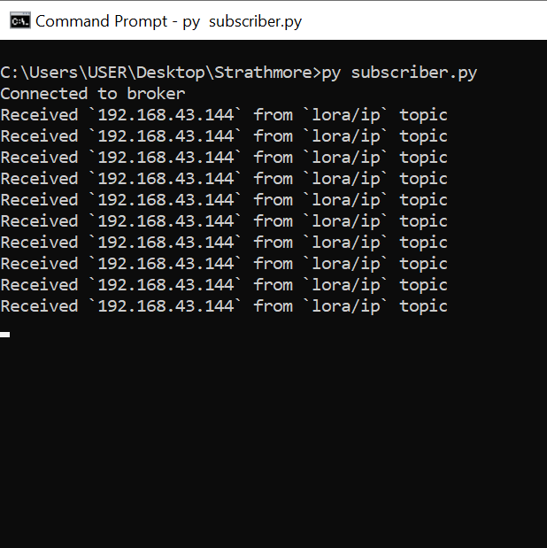
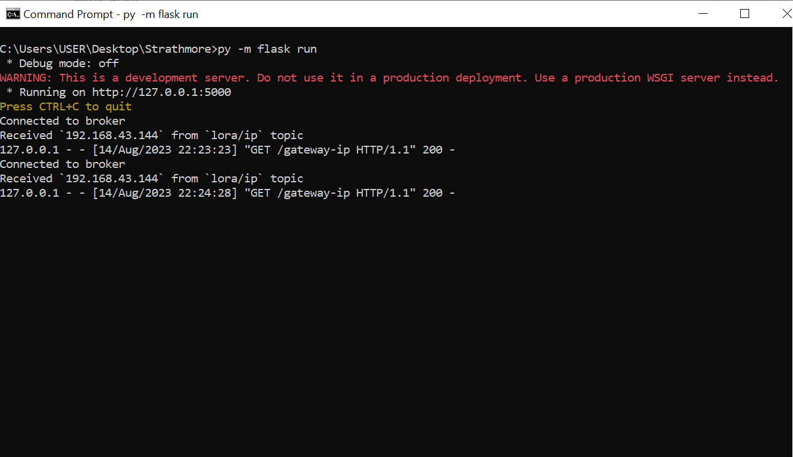
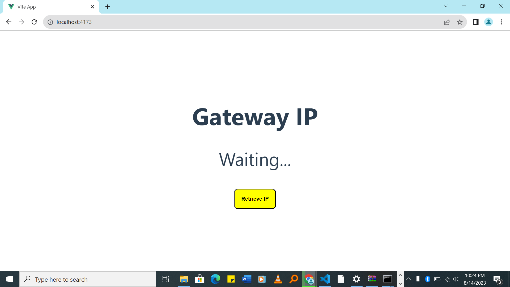
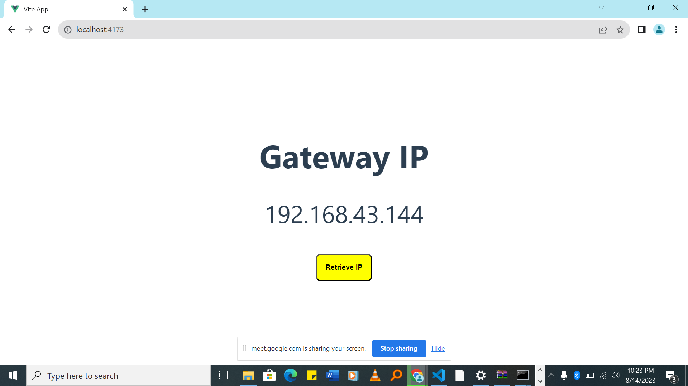

## Requirements
- Python 3+
- Node.js 16+

## Setup
### 1. Run [publisher.py](./publisher.py) on the raspberry pi
#### - Install python dependancies
```bash
pip install paho-mqtt
```
#### - Run the publisher
```bash
python publisher.py
```

### 2. (Optional) Run [subscriber.py](./subscriber.py) to confirm the ip is received.
The ip should be printed after every 5 seconds.

#### - Install python dependancies
```bash
pip install paho-mqtt
```
#### - Run the subscriber
```bash
python subscriber.py
```

### 3. Setup and run the user interface
Flask was used as the backend api and VueJs for the frontend.

#### - Setup the backend
```bash
python install Flask
```
Then in the current directory run
```bash
flask run --port 5000
```
Note: The VueJS frontend will be expecting the backend to be running on port 5000. If you want to change the port, you will need to change the port in the [frontend](./user-interface/src/App.vue) as well.

#### - Setup the frontend
```bash
cd user-interface
npm install
npm run preview
```

## Results
publisher

subscriber

flask

user interface



